# neuromuse

Artificial neural networks to generate music and artistic productions with real-time applications (since 2000).

## History

This project was initiated by Fred Voisin ([www.fredvoisin.com](http://www.fredvoisin.com)) in 1999 to study the application of artificial neural nets to contemporary music creation using, at first, the Lisp language (Macintosh Common Lisp and Common Lisp Object System), OpenMusic software (Ircam, [www.ircam.fr](http://www.ircam.fr)) and the MIDI protocol. Some overall principles were inspired by [David Wessel](http://music.berkeley.edu/who-was-david-wessel/) and [Adrian Freed](https://cnmat.berkeley.edu/people/adrian-freed) at [CNMAT](http://cnmat.berkeley.edu). At this time, the very first ('alpha') version of this project was available at [www.neuromuse.net](http://www.neuromuse.net) and at the OpenMusic Ircam Forum (an [archived snapshot](https://web.archive.org/web/20050910170552/http://www.neuromuse.org/) of the original www.neuromuse.org site, from September 2005). It was also the moment for demos and short public conference-performances (Ircam, the Web-Bar, Prisma composer workshops in Paris and Firenze). Training a recurrent MLP could take hours of computation on the laptops available at the time, and running real-time applications at a symbolic level (MIDI) made it hard to go beyond a few dozen neurons on an IBM PowerPC CPU.

Its first public music applications were produced by me in February 2001 at the Centre National de la Danse in Paris (cf. "Taire", by Toeplitz and [Gourfink](https://www.myriam-gourfink.com/)) and in June 2001 at Ircam (cf. "[L'écarlate](https://www.myriam-gourfink.com/lecarlate/)", by Toeplitz and Gourfink), which demonstrated a link made with the [LOL (Laban Orienté Lisp)](http://archee.qc.ca/ar.php?no=439&page=article) project, with the use of a Macintosh Common Lisp client to control a MIDI server (cf. [MidiShare](http://midishare.sourceforge.net)).

Later, around 2004, different Lisp versions of this project, developed by the author, were used to design equivalent neural net architectures in the [Max](https://fr.wikipedia.org/wiki/Max/MSP) and [Pure Data](https://fr.wikipedia.org/wiki/Pure_Data) real-time programming environments for music production, in collaboration with [Robin Meier](http://robinmeier.net), Arshia Cont and Ali Momeni, with the support of the Centre International de Recherche Musicale at Nice ([www.cirm-manca.org](http://www.cirm-manca.org)).

From 2006 to 2008, new Lisp developments by the author provided a stable real-time multi-agent system, using various Common Lisp implementations such as Lispworks, OpenMCL, CMU-CL and SBCL ([www.sbcl.org](http://www.sbcl.org)), with the use of TCP/IP and multi-threading on the CMU-CL and SBCL implementations for Linux and Mac OS X. Computer music productions such as "Caresses de Marquise" (12-hour performance, Gare de l'Est, Paris, October 2004), "Symphonie des machines" (Meier & Voisin, Sophia-Antipolis 2006) and "Last Manoeuvres in the Dark" (Giraud & Siboni, Palais de Tokyo, Paris 2008) were artistic applications of this version, with some particular adaptations in Python, Java and C++ for distributed multicore ARM ad-hoc architectures (thanks to John McCallum, composer at [CNMAT](http://cnmat.berkeley.edu), Berkeley).

After 2007, the project was also used as teaching material by the author at the Conservatoire de Montbéliard, in the context of computer music master classes.

Even if this project is becoming quite old, it may be a good start for new developments since it's short, simple, easy to use and efficient enough for education and artistic productions.

## Publications

- Voisin, F., Meier, R. (2004). "Playing Integrated Music Knowledges with Artificial Neural Networks."
  Journées d'Informatique Musicale / Sound and Music Computing, Ircam/Centre Pompidou, Paris.
- Voisin, F., Meier, R. (2009). "On Analytical vs. Schizophrenic Procedures for Computing Music."
  *Contemporary Music Review*, 28(2), pp. 205-219.
  [DOI: 10.1080/07494460903322489](https://doi.org/10.1080/07494460903322489)
- Voisin, F. (2015). "De la brousse dans les synthés." In *Gilles Deleuze : la pensée-musique*
  (P. Criton &amp; J.-M. Chouvel, eds.). [hal-01611947](https://hal.science/hal-01611947v1)

## Updates

**July 2026** — the project has been reorganized as a proper ASDF system (`src/`, `tests/`, `examples/`,
`doc/`), with the code moved into its own `:neuromuse` package, a handful of long-standing bugs fixed
(instance saving, network constructors, UDP SOM input), and a real test suite added. Still short, still
simple, hopefully still useful.

New updates in progress with the help of Claude AI, in the former spirit of the neuromuse project.

Fred Voisin.

## TODO

- `src/perceptron.lisp` is marked "unfinished ?, see mlp" and isn't part of the ASDF build; either finish
  it or fold its role entirely into `mlp`.
- `copy-MLP`/`duplicate` (`src/mlp.lisp`) are commented out: they call an undefined `copy-net` and
  reference a nonexistent `:parent` initarg. Net-copying was never actually designed and still needs it.
- `som`'s `save` method (`src/som.lisp`) is commented out and needs the same treatment `mlp`'s `save` got.
- `mlp`'s `save` doesn't perfectly round-trip: it only quotes list-valued slots, so a non-list slot
  holding a symbol (e.g. `:name`) prints unquoted and would be read back as a variable reference.
- Port the graphical rendering used to draw nets (as seen in the Gallery, e.g. `mlp_mcl_macos9.png`),
  originally built on Macintosh Common Lisp's dedicated CLOS toolbox, to something available under SBCL.

---

## Présentation (Nice, mai 2005)

### neuromuse

*Etudes et applications musicales des réseaux neuromimétiques*

Compositeurs, musiciens, chorégraphes et danseurs recourent de plus en plus à l'informatique dans leurs projets, depuis le travail de création, pour l'exploration des possibles jusque la réalisation, selon différentes modalités de communication homme-machine. L'informatique — la machine universelle — est un outil privilégié de formalisation, d'expérimentation, de simulation et de réalisation.

Cependant, lors de mes différentes expériences comme ethnomusicologue et assistant musical, j'ai pu constater que lorsque la communication avec les machines s'effectue au moyen d'un code écrit dans un langage purement logique, la formalisation nécessaire à l'écriture de ce code peut s'avérer contradictoire avec la nature des connaissances invoquées, lesquelles peuvent être intuitives, inconscientes, implicites, contradictoires, irrationnelles ou magiques. L'informatique traditionnelle est encore peu adaptée à ces situations pourtant courantes, et naturelles, où opèrent des connaissances transitoires et des croyances. L'établissement d'une communication pertinente requiert une adaptation et une plasticité instantanées du programme, si ce n'est un mimétisme que suscite inévitablement le test de Turing. Dans ce contexte, les systèmes de réseaux de neurones artificiels, en s'inspirant de processus neurobiologiques, apparaissent comme une alternative particulièrement intéressante dès lors qu'ils situent l'auto-adaptation au cœur même du dispositif informatique.

C'est dans le cadre d'une recherche chorégraphique, en 2000, que j'ai été amené à écrire en langage Lisp mon premier réseau de neurones artificiels. Je constatai alors que si les systèmes neuromimétiques étaient bien capables d'apporter des réponses pertinentes dans les domaines artistiques, la compréhension et la maîtrise de leur fonctionnement constituait un vaste projet.

*Frédéric Voisin, Nice, mai 2005*

   
  <i>www.neuromuse.org home page as of January 22, 2005 (Wayback Machine)</i>

---

## Gallery

### Early experiments (~2000–2004)

  <table>
    <tr>
      <td align="center" width="50%">
         
        <i>A small recurrent MLP trained to interpolate, in real time and slowly, some rhythms on a
        PowerPC G3 laptop running Mac OS 9, ~2000, as demonstrated at an Ircam weekly R&amp;D conference.
        Audio was rendered in real time in Max via MIDI controllers or local UDP, mapped from the 4
        neurons of the output layer (bottom). Nodes represent neurons, links represent synapses, and
        color represents synaptic activation weight.</i>
      </td>
      <td align="center" width="50%">
         
        <i>The two self-organizing maps (content and context) of an agent named "Avatit", written in
        Lisp, rendered in Pd, 2004.</i>
      </td>
    </tr>
  </table>

### Demos &amp; talks

  <table>
    <tr>
      <td align="center" width="50%">
         
        <i>A demo showing a first port of the MLP as "objects" in Max/MSP, able to learn and play in
        real time, at a Prisma composers masterclass.</i>
      </td>
      <td align="center" width="50%">
         
        <i>Invited talk with Robin Meier on neuromuse-based projects, Ars Electronica ("Hybrid — Living
        in Paradox"), September 2005.</i>
      </td>
    </tr>
    <tr>
      <td align="center" width="50%">
        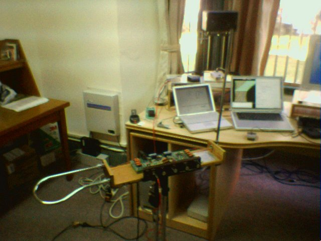 
        <i>Demo/workshop setup, National Taiwan University, Taipei, 2003.</i>
      </td>
      <td align="center" width="50%">
         
        <i>Demo/workshop setup, FNAC Asia, Taipei, 2003.</i>
      </td>
    </tr>
    <tr>
      <td align="center" width="50%">
         
        <i>Cover for computer music lessons at the Conservatoire de Montbéliard, 2007, showing various
        GUIs in use for computer music production, including neuromuse in Lisp/Pd.</i>
      </td>
    </tr>
  </table>

### Taire / L'écarlate (2000–2001)

  <table>
    <tr>
      <td align="center" width="25%">
         
        <i>Declarative/sequential vs. neuromimetic architecture, from the "Taire" paper.</i>
      </td>
      <td align="center" width="25%">
        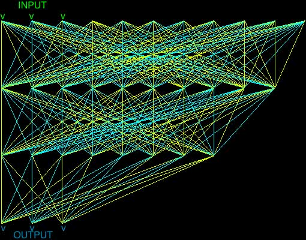 
        <i>MLP topology used for "Taire".</i>
      </td>
      <td align="center" width="25%">
        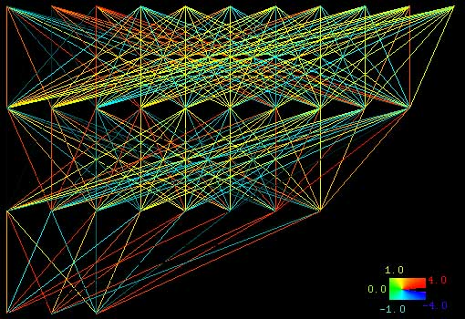 
        <i>Same topology, with a synaptic weight color scale.</i>
      </td>
      <td align="center" width="25%">
        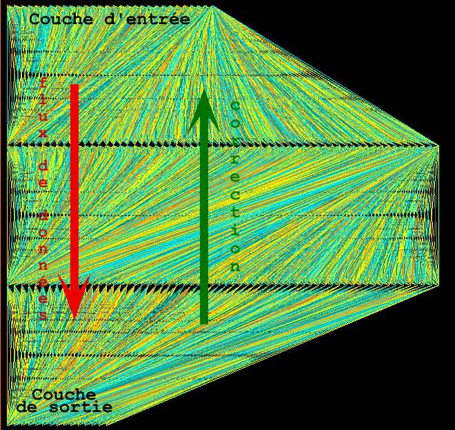 
        <i>Backpropagation data flow through an MLP, from the "Taire" paper.</i>
      </td>
    </tr>
    <tr>
      <td align="center" width="25%">
        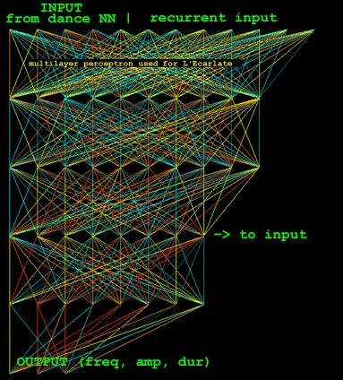 
        <i>Recurrent MLP used for "L'écarlate": dance-derived input recurrently mapped to sound
        synthesis parameters (freq, amp, dur).</i>
      </td>
      <td align="center" width="25%">
         
        <i>"L'écarlate" performance, by Toeplitz and Gourfink, Ircam, June 2001.</i>
      </td>
      <td align="center" width="25%">
        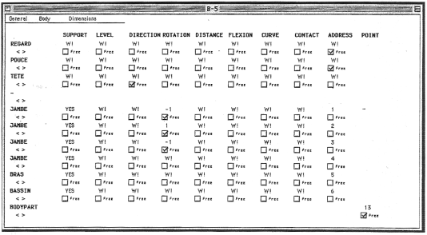 
        <i>LOL (Laban Orienté Lisp) capture interface: movement parameters by body part.</i>
      </td>
      <td align="center" width="25%">
        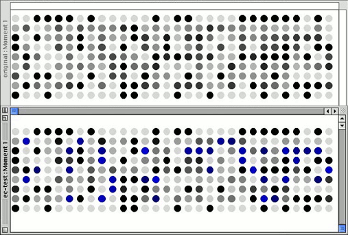 
        <i>LOL movement data: original vs. reconstructed pattern (Moment 1).</i>
      </td>
    </tr>
  </table>

### Symphonie des machines (2006)

  <table>
    <tr>
      <td align="center" width="25%">
        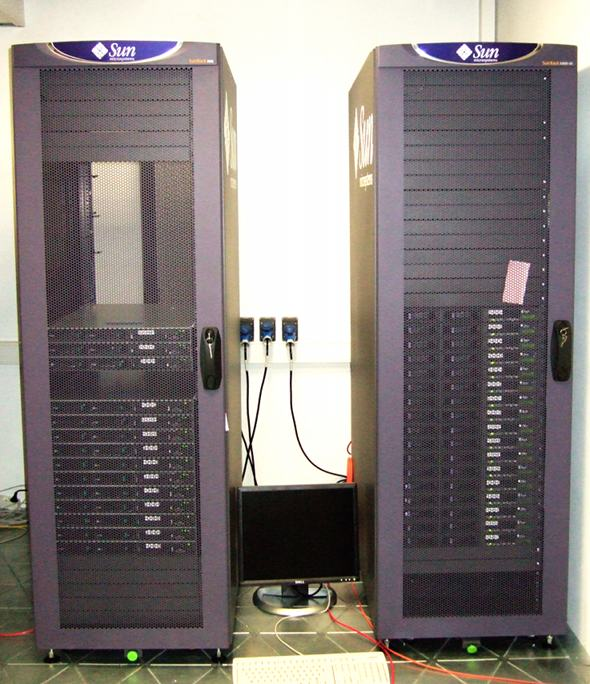 
        <i>Sun servers of the Infineon-donated compute cluster used for "Symphonie des machines".</i>
      </td>
      <td align="center" width="25%">
        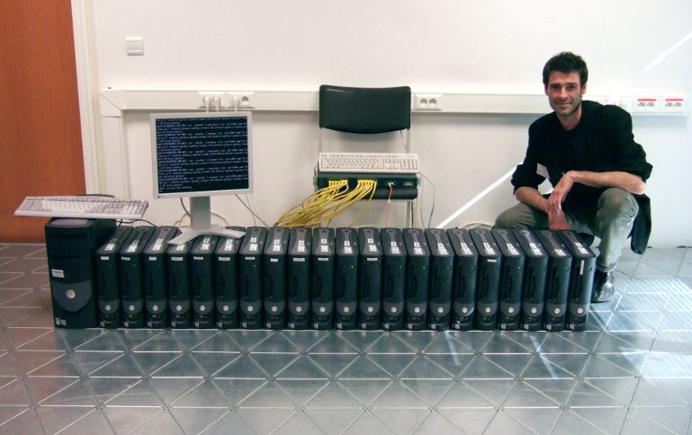 
        <i>The cluster's row of PC nodes.</i>
      </td>
      <td align="center" width="25%">
         
        <i>EtherApe network map of the cluster's topology.</i>
      </td>
      <td align="center" width="25%">
        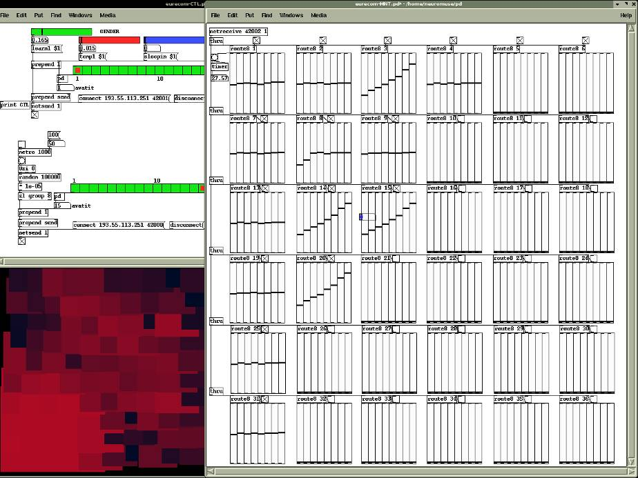 
        <i>The Pure Data GUI to control 25 Lisp "avatit" agents dispatched on a grid, at
        Eurecom, Sophia-Antipolis.</i>
      </td>
    </tr>
  </table>

### Last Manoeuvres in the Dark (2008)

  <table>
    <tr>
      <td align="center" width="33%">
        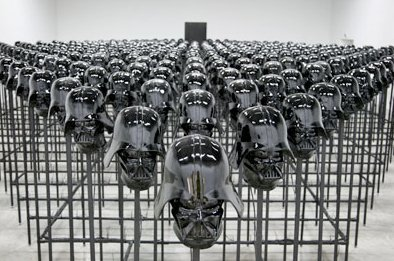 
        <i>The neural activation decoder: rows of Darth Vader helmet sculptures, Palais de Tokyo,
        Paris, 2008.</i>
      </td>
      <td align="center" width="33%">
        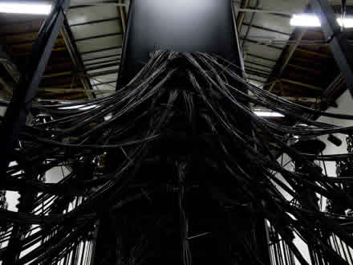 
        <i>Cabling rig distributing signal to the helmet array.</i>
      </td>
      <td align="center" width="33%">
        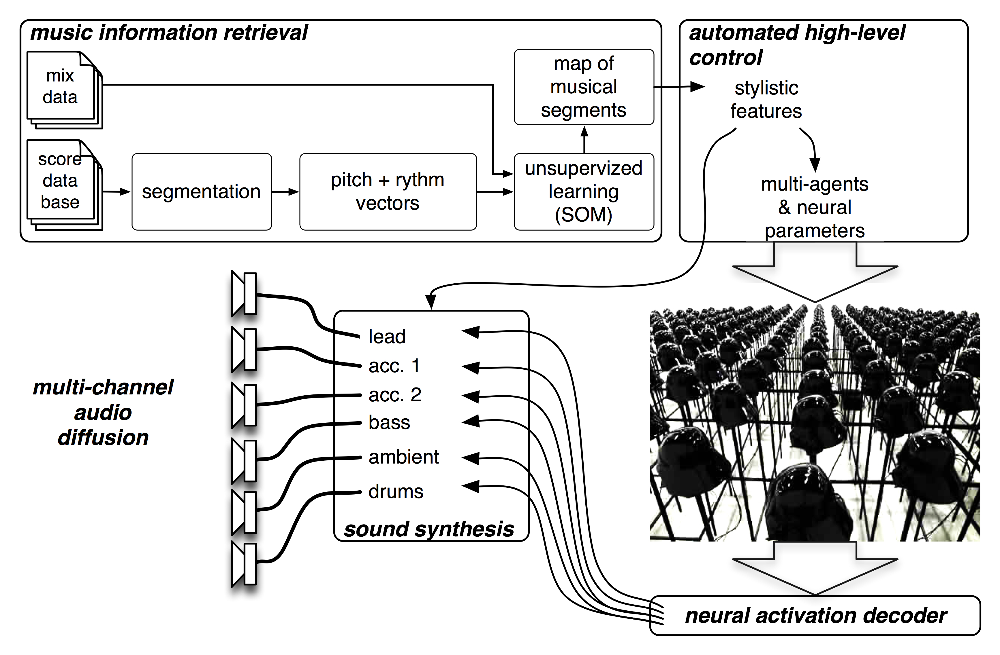 
        <i>System diagram: music information retrieval, SOM-based stylistic analysis, multi-agent/neural
        control, and the neural activation decoder.</i>
      </td>
    </tr>
    <tr>
      <td align="center" width="100%">
        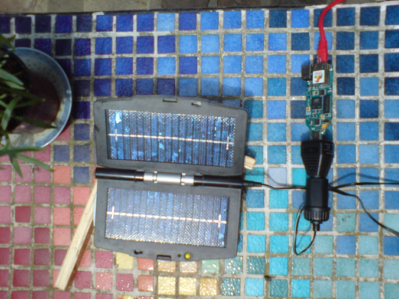 
        <i>A Calao board powered by a portable solar panel, each running a neuromuse Java agent.</i>
      </td>
    </tr>
  </table>

### Distributed ARM cluster (Calao boards)

  <table>
    <tr>
      <td align="center" width="100%">
        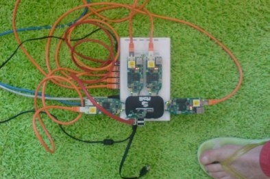 
        <i>Five neuromuse agents in Java playing live on Calao motherboards running Linux, audio rendered
        through UDP with a local Max/MSP ad-hoc patch.</i>
      </td>
    </tr>
  </table>

### Effet Lisière (Diois)

  <table>
    <tr>
      <td align="center" width="50%">
         
        <i>Output of a recurrent oscillatory SOM (rosom), before learning the song of the pouillot fitis
        (willow warbler), for "Effet Lisière", by Jean-Luc Hervé, in the Diois.</i>
      </td>
      <td align="center" width="50%">
         
        <i>The same rosom's output after hundreds of epochs of learning.</i>
      </td>
    </tr>
  </table>

