# neuromuse

Artificial neural networks to generate music and artistic productions with real-time applications, since 2000 by <a href="https://www.fredvoisin.com/">Fred Voisin.</a>

Even if this project is becoming quite old, it is still short, simple, and efficient enough for
education and artistic productions in real time. It now runs under [SBCL](http://www.sbcl.org) as a
proper ASDF system (`src/`, `tests/`, `examples/`, `doc/`), and new developments are ongoing, in the
spirit of the original project — see [Updates](#updates) below.

The presentation that follows is the project's original one, written in 2005; kept as-is for its
historical value.

## Présentation (Nice, mai 2005)

### neuromuse

*Etudes et applications musicales des réseaux neuromimétiques*

Compositeurs, musiciens, chorégraphes et danseurs recourent de plus en plus à l'informatique dans leurs projets, depuis le travail de création, pour l'exploration des possibles jusque la réalisation, selon différentes modalités de communication homme-machine. L'informatique — la machine universelle — est un outil privilégié de formalisation, d'expérimentation, de simulation et de réalisation.

Cependant, lors de mes différentes expériences comme ethnomusicologue et assistant musical, j'ai pu constater que lorsque la communication avec les machines s'effectue au moyen d'un code écrit dans un langage purement logique, la formalisation nécessaire à l'écriture de ce code peut s'avérer contradictoire avec la nature des connaissances invoquées, lesquelles peuvent être intuitives, inconscientes, implicites, contradictoires, irrationnelles ou magiques. L'informatique traditionnelle est encore peu adaptée à ces situations pourtant courantes, et naturelles, où opèrent des connaissances transitoires et des croyances. L'établissement d'une communication pertinente requiert une adaptation et une plasticité instantanées du programme, si ce n'est un mimétisme que suscite inévitablement le test de Turing. Dans ce contexte, les systèmes de réseaux de neurones artificiels, en s'inspirant de processus neurobiologiques, apparaissent comme une alternative particulièrement intéressante dès lors qu'ils situent l'auto-adaptation au cœur même du dispositif informatique.

C'est dans le cadre d'une recherche chorégraphique, en 2000, que j'ai été amené à écrire en langage Lisp mon premier réseau de neurones artificiels. Je constatai alors que si les systèmes neuromimétiques étaient bien capables d'apporter des réponses pertinentes dans les domaines artistiques, la compréhension et la maîtrise de leur fonctionnement constituait un vaste projet.

*Frédéric Voisin, Nice, mai 2005*

<p align="center">
  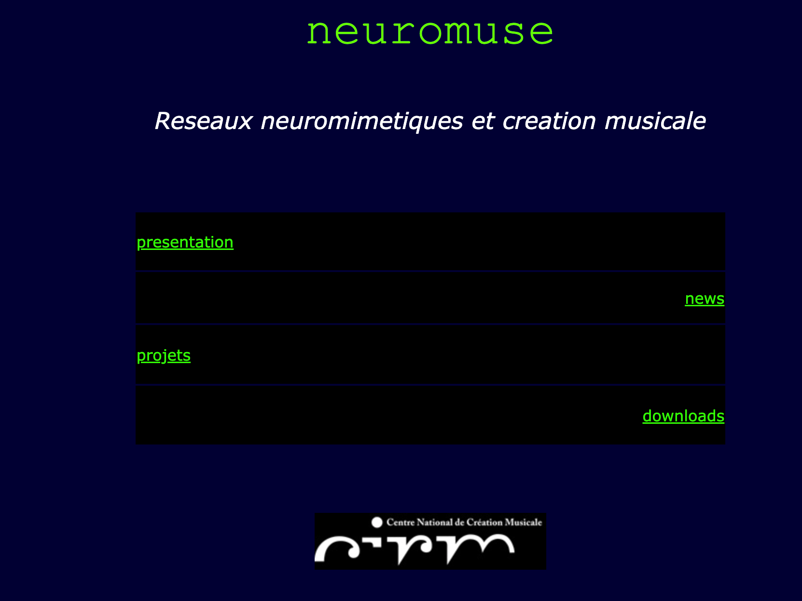<br>
  <sub><i>www.neuromuse.org home page as of January 22, 2005 (Wayback Machine)</i></sub>
</p>

---

## Updates

**July 2026** — the project has been reorganized as a proper ASDF system (`src/`, `tests/`, `examples/`,
`doc/`), with the code moved into its own `:neuromuse` package, a handful of long-standing bugs fixed
(instance saving, network constructors, UDP SOM input), and a real test suite added. Still short, still
simple, hopefully still useful.


## How to install and run

### Requirements

- [SBCL](http://www.sbcl.org)
- [Quicklisp](https://www.quicklisp.org/) (needed to fetch `:prove`, the test-suite dependency)
- Emacs with [SLIME](https://slime.common-lisp.dev/) (recommended, for an interactive REPL workflow)

### Installation

1. Clone this repository, e.g. into `~/projets/neuromuse`.
2. Make it visible to ASDF/Quicklisp, either by symlinking it into Quicklisp's `local-projects`:
   ```bash
   ln -s ~/projets/neuromuse ~/quicklisp/local-projects/neuromuse
   ```
   or by pushing it onto `asdf:*central-registry*` from the Lisp REPL instead (see below).
3. Start Emacs, then start a Lisp REPL with `M-x slime`.
4. Load the system:
   ```lisp
   (ql:quickload :neuromuse)
   (in-package :neuromuse)
   ```
   (if you skipped the symlink step, use `(push #P"~/projets/neuromuse/" asdf:*central-registry*)` followed
   by `(asdf:load-system :neuromuse)` instead).
5. Try it:
   ```lisp
   (load "examples/mlp-test.lisp")   ; trains a small MLP on XOR
   ```
   or run the test suite: `(asdf:test-system :neuromuse)` (Quicklisp will fetch `:prove` automatically the
   first time).

### Day-to-day Emacs/SLIME workflow

Once a `.lisp` file is open in Emacs:

- `C-c C-k` — compile/load the whole file
- `C-c C-c` — compile the top-level form under point
- `C-c C-z` — jump to the REPL buffer

Evaluating forms updates the running Lisp image live, so you can redefine a method and re-test it
without restarting.

## TO DO

- `src/perceptron.lisp` is marked "unfinished ?, see mlp" and isn't part of the ASDF build; either finish
  it or fold its role entirely into `mlp`.
- `copy-MLP`/`duplicate` (`src/mlp.lisp`) are commented out: they call an undefined `copy-net` and
  reference a nonexistent `:parent` initarg. Net-copying was never actually designed and still needs it.
- `som`'s `save` method (`src/som.lisp`) is commented out and needs the same treatment `mlp`'s `save` got.
- `mlp`'s `save` doesn't perfectly round-trip: it only quotes list-valued slots, so a non-list slot
  holding a symbol (e.g. `:name`) prints unquoted and would be read back as a variable reference.
- Port the graphical rendering used to draw nets (as seen in the Gallery, e.g. `mlp_mcl_macos9.png`),
  originally built on Macintosh Common Lisp's dedicated CLOS toolbox, to something available under SBCL.
- Add a Jordan arch to the recurrent mlsp (rmlp), so that a arg may specify arch (Elman|Jordan|...).

### In progress
- Investigation on GPU optimisation:
   (July 2026): benchmarked `mgl-mat` (CPU-BLAS and CUDA/cuBLAS backends) against the existing list-based
  matrix code — see `examples/benchmark-mgl-mat.lisp`. At neuromuse's actual real-time net sizes (a handful
  of neurons, e.g. the 2-2-1 XOR and 6-4-1 accelerometer examples), the current list-based code is ~40x
  faster than mgl-mat/BLAS, since call overhead dominates at that scale; the list-based code only wins less as networks get much larger than anything neuromuse
  actually uses.
  Unfortunatly, CUDA/cuBLAS turned out unusable on my dev machine's GTX 950M (Maxwell) under a
  modern CUDA 13 toolkit (`CUBLAS_STATUS_ARCH_MISMATCH`). Any donation, time or modern Nvidia card would be appreciated
  to investigate further ! See [`doc/memo-cuda-gtx950m-debian12.md`](doc/memo-cuda-gtx950m-debian12.md)
  for the detailed notes on getting CUDA working (and the next blocker found) on this GPU.

## Examples

### Training an MLP on XOR

This walks through `examples/mlp-test.lisp` — a minimal, complete example of training a
multi-layer perceptron with backpropagation on the classic XOR problem (not linearly separable,
so it's a good sanity check that backprop and a hidden layer are actually working).

**1. The data.** Each input is a 2-value vector (as a list), each goal its matching 1-value
target output:
```lisp
(defvar *xor-in* '((0 0) (1 0) (0 1) (1 1)))
(defvar *xor-goal* '((0) (1) (1) (0)))
```

**2. Build the network.** `make-mlp` takes a name, then `in-size`, `out-size`, and any number of
hidden-layer sizes — here 2 inputs, 1 output, one hidden layer of 2 neurons:
```lisp
(make-mlp xor 2 1 2)
```
This expands into a `defvar`/`setf` form that constructs an `mlp` instance and binds it to the
symbol `xor`.

**3. Configure it.**
```lisp
(let ((mlp xor))
  (setf (learn-fact mlp) .4
        (temp mlp) .1
        (verbose mlp) t
        (threshold mlp) .1
        (input mlp) (car *xor-in*)
        (goal mlp) (car *xor-goal*)))
```
`learn-fact` is the backpropagation learning rate — a freshly-built `mlp` defaults it to `0.0`,
so nothing is learned until you set it yourself. `temp` adds a bit of stochastic noise during
training (see `noise` in `src/maths.lisp`). `threshold` is the training-loop stop condition
below.

**4. Train.**
```lisp
(let ((mlp xor) (in *xor-in*) (goal *xor-goal*) (e 999999))
  (loop until (< e (threshold mlp))
        do (loop for i from 0 to (- (length in) 2)
                 do (setf (input mlp) (nth i in)
                          (goal mlp) (nth i goal)
                          e (backpropagate mlp))
                    (format t "~&epoch ~S, e = ~S" (epoch mlp) e))))
```
Each call to `backpropagate` does one forward pass plus one weight update for the current
`input`/`goal` pair, and returns that pair's error. The loop keeps cycling through the training
set until the error drops below `threshold`. (Note: as written, the inner loop bound
`(- (length in) 2)` only visits 3 of the 4 XOR patterns per epoch — worth knowing if you're
comparing error curves against a from-scratch version of this loop.)

**5. Check the result.**
```lisp
(dolist (input *xor-in*)
  (setf (input xor) input)
  (run-mlp xor)
  (format t "~S : ~S~&" input (apply #'round (output xor))))
```
`run-mlp` does a forward pass only (no learning) and stores the result in `(output xor)`. After
training, each of the four XOR inputs should round to its correct output (`(0 0)` → 0, `(1 0)` →
1, `(0 1)` → 1, `(1 1)` → 0).

**Trying your own problem:** swap in different `*xor-in*`/`*xor-goal*` data (same shape: a list
of input vectors and a list of matching goal vectors) and a `make-mlp` call sized to match — the
training/testing loop above works unchanged. `examples/mlp-test2.lisp` does exactly this for
6-input accelerometer data.

## FAQ

**Is `rmlp` Elman or Jordan?** Elman: its recurrent feedback comes from a hidden layer's
activation, not the output layer's. See
[`doc/rmlp-elman-vs-jordan.md`](doc/rmlp-elman-vs-jordan.md) for the code walkthrough plus a
structural test (the feedback vector's length matches the hidden layer, not `out-size`) and a
behavioral test (a 1-step delayed-copy memory task: 46.9% for a plain `mlp` vs 90.0% for the
`rmlp`) confirming it.

---

## History

This project was initiated by Fred Voisin ([www.fredvoisin.com](http://www.fredvoisin.com)) in 1999 to study the application of artificial neural nets to contemporary music creation using, at first, the Lisp language (Macintosh Common Lisp and Common Lisp Object System), OpenMusic software (Ircam, [www.ircam.fr](http://www.ircam.fr)) and the MIDI protocol. Some overall principles were inspired by [David Wessel](http://music.berkeley.edu/who-was-david-wessel/) and [Adrian Freed](https://cnmat.berkeley.edu/people/adrian-freed) at [CNMAT](http://cnmat.berkeley.edu). At this time, the very first ('alpha') version of this project was available at [www.neuromuse.net](http://www.neuromuse.net) and at the OpenMusic Ircam Forum (an [archived snapshot](https://web.archive.org/web/20050910170552/http://www.neuromuse.org/) of the original www.neuromuse.org site, from September 2005). It was also the moment for demos and short public conference-performances (Ircam, the Web-Bar, Prisma composer workshops in Paris and Firenze). Training a recurrent MLP could take hours of computation on the laptops available at the time, and running real-time applications at a symbolic level (MIDI) made it hard to go beyond a few dozen neurons on an IBM PowerPC CPU.

Its first public music applications were produced by me in February 2001 at the Centre National de la Danse in Paris (cf. "Taire", by Toeplitz and [Gourfink](https://www.myriam-gourfink.com/)) and in June 2001 at Ircam (cf. "[L'écarlate](https://www.myriam-gourfink.com/lecarlate/)", by Toeplitz and Gourfink), which demonstrated a link made with the [LOL (Laban Orienté Lisp)](http://archee.qc.ca/ar.php?no=439&page=article) project, with the use of a Macintosh Common Lisp client to control a MIDI server (cf. [MidiShare](http://midishare.sourceforge.net)).

Later, around 2004, different Lisp versions of this project, developed by the author, were used to design equivalent neural net architectures in the [Max](https://fr.wikipedia.org/wiki/Max/MSP) and [Pure Data](https://fr.wikipedia.org/wiki/Pure_Data) real-time programming environments for music production, in collaboration with [Robin Meier](http://robinmeier.net), Arshia Cont and Ali Momeni, with the support of the Centre International de Recherche Musicale at Nice ([www.cirm-manca.org](http://www.cirm-manca.org)).

From 2006 to 2008, new Lisp developments by the author provided a stable real-time multi-agent system, using various Common Lisp implementations such as Lispworks, OpenMCL, CMU-CL and SBCL ([www.sbcl.org](http://www.sbcl.org)), with the use of TCP/IP and multi-threading on the CMU-CL and SBCL implementations for Linux and Mac OS X. Computer music productions such as "Caresses de Marquise" (12-hour performance, Gare de l'Est, Paris, October 2004), "Symphonie des machines" (Meier & Voisin, Sophia-Antipolis 2006) and "Last Manoeuvres in the Dark" (Giraud & Siboni, Palais de Tokyo, Paris 2008) were artistic applications of this version, with some particular adaptations in Python, Java and C++ for distributed multicore ARM ad-hoc architectures (thanks to John McCallum, composer at [CNMAT](http://cnmat.berkeley.edu), Berkeley).

After 2007, the project was also used as teaching material by the author at the Conservatoire de Montbéliard, in the context of computer music master classes.

Even if this project is becoming quite old, it may be a good start for new developments since it's short, simple, easy to use and efficient enough for education and artistic productions.

## Publications

- Voisin, F., Meier, R. (2004). "Playing Integrated Music Knowledges with Artificial Neural Networks."
  Journées d'Informatique Musicale / Sound and Music Computing, Ircam/Centre Pompidou, Paris.
- Voisin, F., Meier, R. (2009). "On Analytical vs. Schizophrenic Procedures for Computing Music."
  *Contemporary Music Review*, 28(2), pp. 205-219.
  [DOI: 10.1080/07494460903322489](https://doi.org/10.1080/07494460903322489)
- Voisin, F. (2015). "De la brousse dans les synthés." In *Gilles Deleuze : la pensée-musique*
  (P. Criton &amp; J.-M. Chouvel, eds.). [hal-01611947](https://hal.science/hal-01611947v1)

---

## Gallery

### Early experiments (~2000–2004)

<p align="center">
  <table>
    <tr>
      <td align="center" width="50%">
        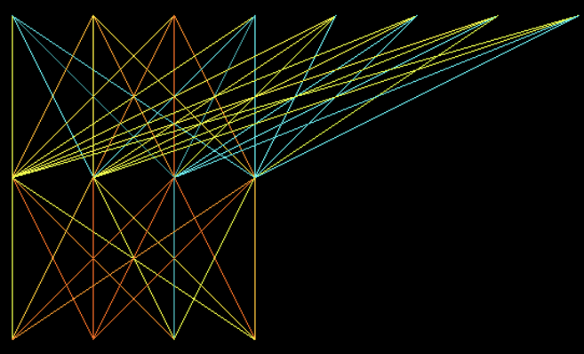<br>
        <sub><i>A small recurrent MLP trained to interpolate, in real time and slowly, some rhythms on a
        PowerPC G3 laptop running Mac OS 9, ~2000, as demonstrated at an Ircam weekly R&amp;D conference.
        Audio was rendered in real time in Max via MIDI controllers or local UDP, mapped from the 4
        neurons of the output layer (bottom). Nodes represent neurons, links represent synapses, and
        color represents synaptic activation weight.</i></sub>
      </td>
      <td align="center" width="50%">
        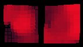<br>
        <sub><i>The two self-organizing maps (content and context) of an agent named "Avatit", written in
        Lisp, rendered in Pd, 2004.</i></sub>
      </td>
    </tr>
    <tr>
      <td align="center" width="100%">
        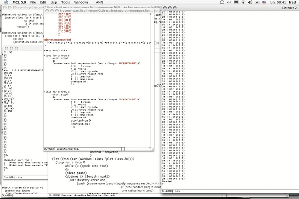<br>
        <sub><i>The first working rosom, in Macintosh Common Lisp: a proof of concept, learning a sine wave
        in the symbolic domain.</i></sub>
      </td>
    </tr>
  </table>
</p>

### Demos &amp; talks

<p align="center">
  <table>
    <tr>
      <td align="center" width="50%">
        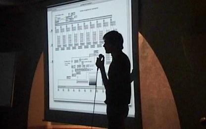<br>
        <sub><i>A demo showing a first port of the MLP as "objects" in Max/MSP, able to learn and play in
        real time, at a Prisma composers masterclass.</i></sub>
      </td>
      <td align="center" width="50%">
        <br>
        <sub><i>Invited talk with Robin Meier on neuromuse-based projects, Ars Electronica ("Hybrid — Living
        in Paradox"), September 2005.</i></sub>
      </td>
    </tr>
    <tr>
      <td align="center" width="50%">
        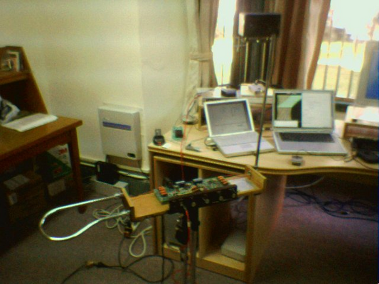<br>
        <sub><i>Demo/workshop setup, National Taiwan University, Taipei, 2003.</i></sub>
      </td>
      <td align="center" width="50%">
        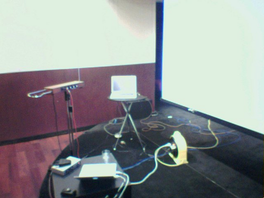<br>
        <sub><i>Demo/workshop setup, FNAC Asia, Taipei, 2003.</i></sub>
      </td>
    </tr>
    <tr>
      <td align="center" width="50%">
        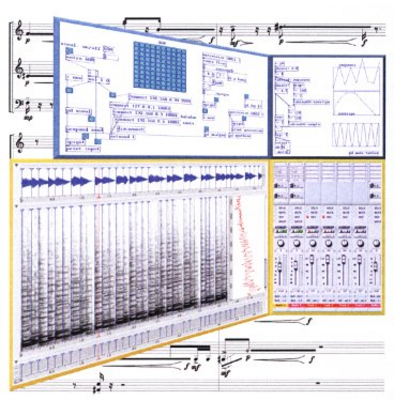<br>
        <sub><i>Cover for computer music lessons at the Conservatoire de Montbéliard, 2007, showing various
        GUIs in use for computer music production, including neuromuse in Lisp/Pd.</i></sub>
      </td>
    </tr>
  </table>
</p>

### Taire / L'écarlate (2000–2001)

<p align="center">
  <table>
    <tr>
      <td align="center" width="25%">
        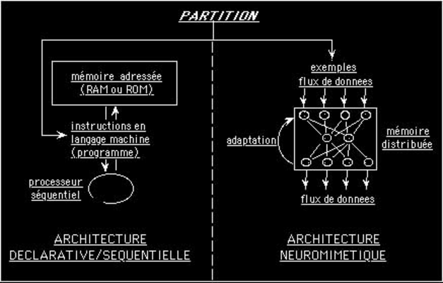<br>
        <sub><i>Declarative/sequential vs. neuromimetic architecture, from the "Taire" paper.</i></sub>
      </td>
      <td align="center" width="25%">
        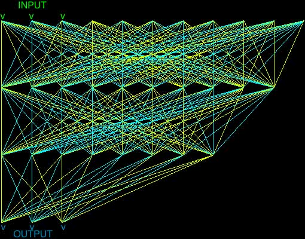<br>
        <sub><i>MLP topology used for "Taire".</i></sub>
      </td>
      <td align="center" width="25%">
        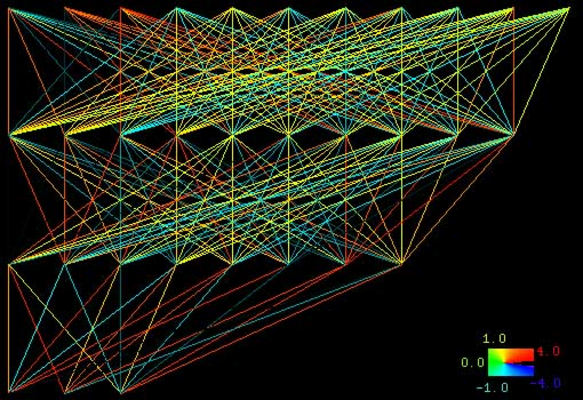<br>
        <sub><i>Same topology, with a synaptic weight color scale.</i></sub>
      </td>
      <td align="center" width="25%">
        <br>
        <sub><i>Backpropagation data flow through an MLP, from the "Taire" paper.</i></sub>
      </td>
    </tr>
    <tr>
      <td align="center" width="25%">
        <br>
        <sub><i>Recurrent MLP used for "L'écarlate": dance-derived input recurrently mapped to sound
        synthesis parameters (freq, amp, dur).</i></sub>
      </td>
      <td align="center" width="25%">
        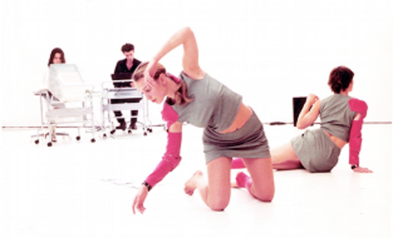<br>
        <sub><i>"L'écarlate" performance, by Toeplitz and Gourfink, Ircam, June 2001.</i></sub>
      </td>
      <td align="center" width="25%">
        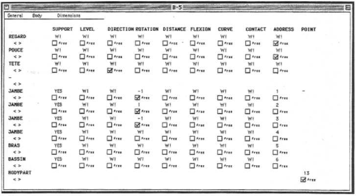<br>
        <sub><i>LOL (Laban Orienté Lisp) capture interface: movement parameters by body part.</i></sub>
      </td>
      <td align="center" width="25%">
        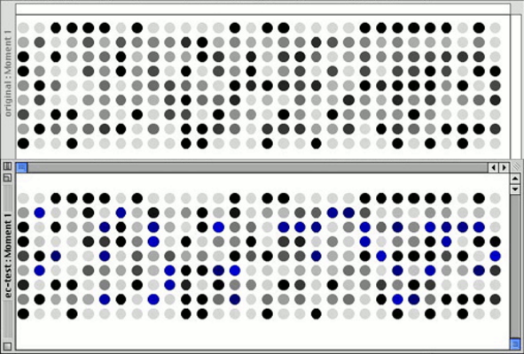<br>
        <sub><i>LOL movement data: original vs. reconstructed pattern (Moment 1).</i></sub>
      </td>
    </tr>
  </table>
</p>

### CIRM Nice residency (2004)

<p align="center">
  <table>
    <tr>
      <td align="center" width="33%">
        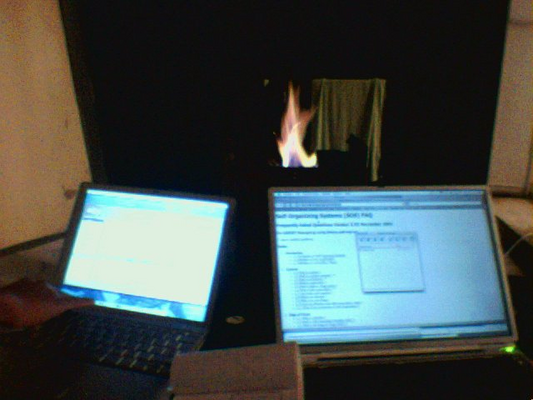<br>
        <sub><i>Work session, CIRM Nice residency, July 2004.</i></sub>
      </td>
      <td align="center" width="33%">
        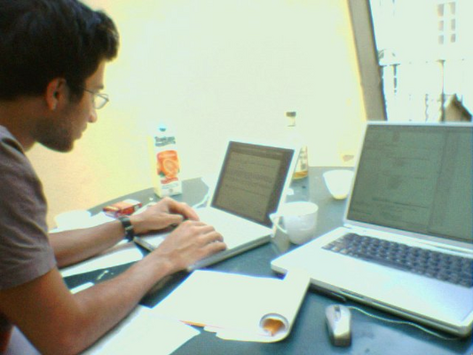<br>
        <sub><i>Work session, CIRM Nice residency, July 2004.</i></sub>
      </td>
      <td align="center" width="33%">
        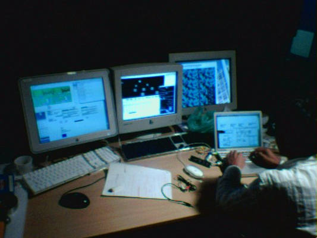<br>
        <sub><i>Robin Meier coding a rosom in Max/MSP Jitter, CIRM Nice, 2004.</i></sub>
      </td>
    </tr>
  </table>
</p>

### Symphonie des machines (2006)

<p align="center">
  <table>
    <tr>
      <td align="center" width="25%">
        <br>
        <sub><i>Sun servers of the Infineon-donated compute cluster used for "Symphonie des machines".</i></sub>
      </td>
      <td align="center" width="25%">
        <br>
        <sub><i>The cluster's row of PC nodes.</i></sub>
      </td>
      <td align="center" width="25%">
        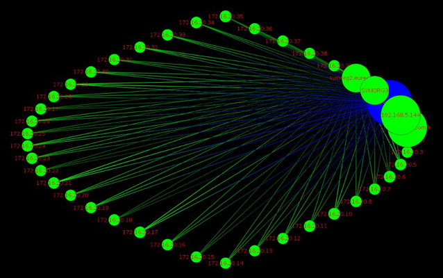<br>
        <sub><i>EtherApe network map of the cluster's topology.</i></sub>
      </td>
      <td align="center" width="25%">
        <br>
        <sub><i>The Pure Data GUI to control 25 Lisp "avatit" agents dispatched on a grid, at
        Eurecom, Sophia-Antipolis.</i></sub>
      </td>
    </tr>
    <tr>
      <td align="center" width="100%">
        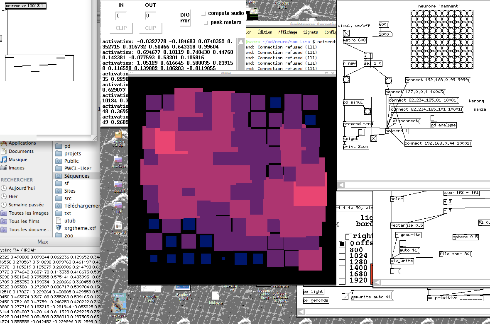<br>
        <sub><i>SOM computed in Lisp, bridged to Pd and Max via UDP, for "Symphonie des machines".</i></sub>
      </td>
    </tr>
  </table>
</p>

### Effet Lisière (Diois, 2008)

<p align="center">
  <table>
    <tr>
      <td align="center" width="50%">
        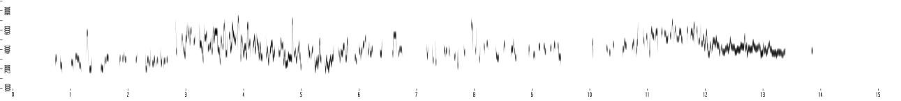<br>
        <sub><i>Output of a recurrent oscillatory SOM (rosom), before learning the song of the pouillot fitis
        (willow warbler), for "Effet Lisière", by Jean-Luc Hervé, in the Diois.</i></sub>
      </td>
      <td align="center" width="50%">
        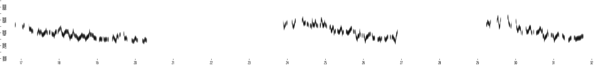<br>
        <sub><i>The same rosom's output after hundreds of epochs of learning.</i></sub>
      </td>
    </tr>
  </table>
</p>

### Last Manoeuvres in the Dark (2008)

<p align="center">
  <table>
    <tr>
      <td align="center" width="50%">
        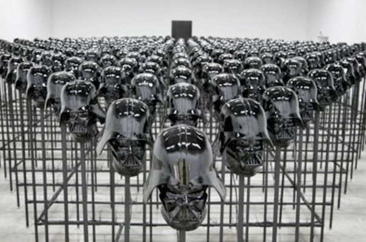<br>
        <sub><i>The neural activation decoder: rows of Darth Vader helmet sculptures, Palais de Tokyo,
        Paris, 2008.</i></sub>
      </td>
      <td align="center" width="50%">
        <br>
        <sub><i>Cabling rig distributing signal to the helmet array.</i></sub>
      </td>
    </tr>
    <tr>
      <td align="center" width="100%">
        <br>
        <sub><i>System diagram: music information retrieval, SOM-based stylistic analysis, multi-agent/neural
        control, and the neural activation decoder.</i></sub>
      </td>
    </tr>
    <tr>
      <td align="center" width="100%">
        <br>
        <sub><i>A Calao board powered by a portable solar panel, each running a neuromuse Java agent.</i></sub>
      </td>
    </tr>
    <tr>
      <td align="center" width="100%">
        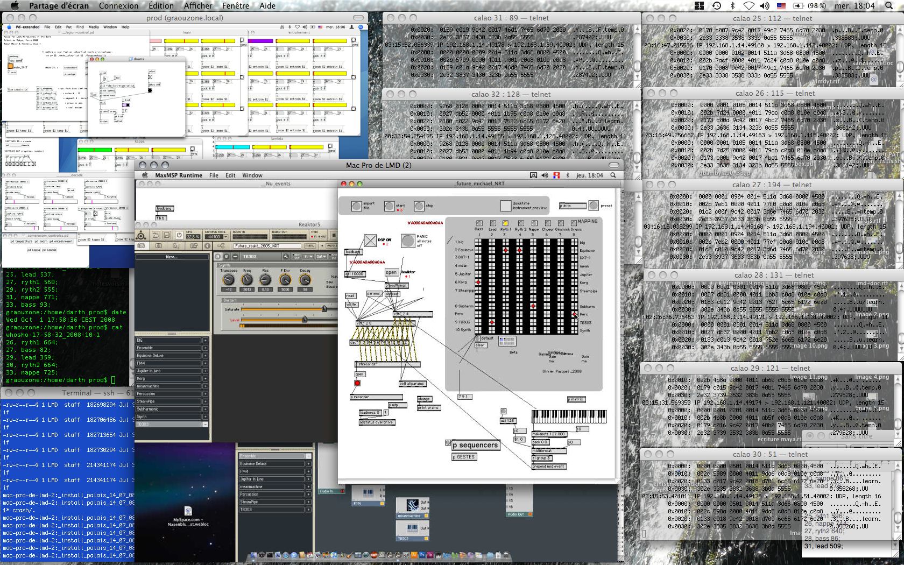<br>
        <sub><i>The control room: training agents on a cluster of Calao boards and playing them back in real
        time.</i></sub>
      </td>
    </tr>
  </table>
</p>

### Distributed ARM cluster (Calao boards)

<p align="center">
  <table>
    <tr>
      <td align="center" width="100%">
        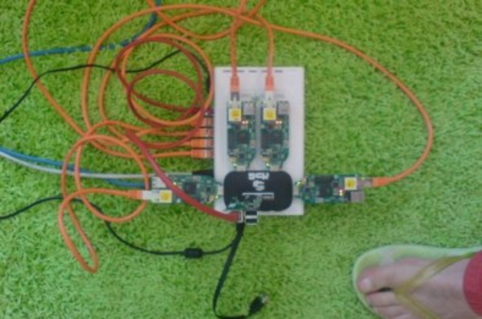<br>
        <sub><i>Five neuromuse agents in Java playing live on Calao motherboards running Linux, audio rendered
        through UDP with a local Max/MSP ad-hoc patch.</i></sub>
      </td>
    </tr>
  </table>
</p>

### Since 2012

<p align="center">
  <table>
    <tr>
      <td align="center" width="100%">
        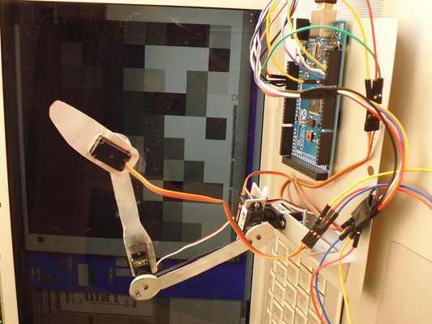<br>
        <sub><i>Neuromuse (avatit) still alive underground at Ircam in 2015, controlling a robot arm on an
        ARM CPU (photo 2025).</i></sub>
      </td>
    </tr>
    <tr>
      <td align="center" width="100%">
        <br>
        <sub><i>System diagram for a research engineering application in cognitive rehabilitation: mime
        gesture recognition (MLP), movement descriptors, and gesture/sound mapping to a sampler. LEAD lab,
        CNRS-Université de Bourgogne, 2017.</i></sub>
      </td>
    </tr>
  </table>
</p>
