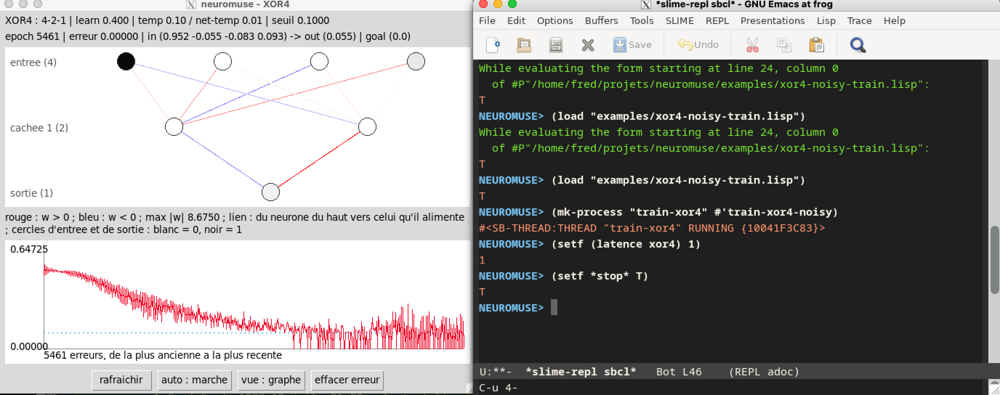

# Examples: Training Neural Networks with neuromuse

This guide walks through detailed examples, starting with the minimal XOR case and moving to real-world problems.

## 1. Training an MLP on XOR

**File:** `examples/mlp-test.lisp`

XOR (exclusive OR) is a classic problem: given two binary inputs, output 1 if exactly one is 1, else 0. It's linearly inseparable, so a single-layer network fails—you need hidden units and backpropagation.

### The Data

```lisp
(defvar *xor-in*   '((0 0) (1 0) (0 1) (1 1)))
(defvar *xor-goal* '((0)   (1)   (1)   (0)))
```

Each input is a list (e.g., `(1 0)`), each goal is its target output.

### Build the Network

```lisp
(make-mlp xor 2 1 2)
```

Expands to:
```lisp
(defvar xor (make-instance 'mlp :in-size 2 :out-size 1 :hidden-sizes '(2)))
```

This creates a multi-layer perceptron with:
- 2 input neurons
- 1 hidden layer of 2 neurons
- 1 output neuron

### Configure Learning Parameters

```lisp
(let ((net xor))
  (setf (learn-fact net) 0.4
        (temp net) 0.1
        (verbose net) t
        (threshold net) 0.1
        (input net) (car *xor-in*)
        (goal net) (car *xor-goal*)))
```

- **`learn-fact`** (learning rate): Controls how much weights change per epoch. Default is 0.0 (no learning), so you must set it.
- **`temp`** (temperature): *Not* what it sounds like — `logistic`'s `:temp` makes a neuron output pure
  `(random 1.0)` noise with probability `temp` on every call (see `temp-value` in `src/maths.lisp`), it
  doesn't nudge gradients to help escape local minima. `net-temp` (jittering the *weights* a little
  during training) is the one that actually helps with that — see the box below.
- **`verbose`**: Print progress during training.
- **`threshold`**: Stop training when error drops below this.

### Train the Network

```lisp
(let ((net xor) (in *xor-in*) (goal *xor-goal*) (e 999999))
  (loop until (< e (threshold net))
        do (loop for i from 0 to (- (length in) 2)
                 do (setf (input net) (nth i in)
                          (goal net) (nth i goal)
                          e (backpropagate net))
                    (format t "~&epoch ~S, e = ~S" (epoch net) e))))
```

- **`backpropagate`**: One forward pass + one weight update. Returns the error for the current input/goal pair.
- **`epoch`**: Number of training iterations so far.

*Note:* The inner loop bound `(- (length in) 2)` visits only 3 of 4 patterns per epoch (a quirk to know about if comparing curves).

### Test the Result

```lisp
(dolist (input *xor-in*)
  (setf (input xor) input)
  (run-mlp xor)
  (format t "~S : ~S~&" input (apply #'round (output xor))))
```

- **`run-mlp`**: Forward pass only (no learning).
- **`output`**: Result after forward pass, a list like `(0.98)` or `(0.02)`.
- **`round`**: Convert to nearest integer.

Expected output:
```
(0 0) : 0
(1 0) : 1
(0 1) : 1
(1 1) : 0
```

In practice this "expected output" isn't reliable as the code stands above — see the investigation below.

### Why the "expected output" isn't reliable, and how the README's Quick Start fixes it

*The following is Claude's (Anthropic's AI coding assistant) investigation and fix, done at Fred's
request after the README's own XOR Quick Start turned out to be flaky in the same way. Fred's own,
more general fix — described at the end — is still to come.*

Running the training loop above (or the near-identical one in `examples/mlp-test.lisp` and the
README's original Quick Start) with a fresh random seed each time, and checking the final predictions
against the XOR truth table, essentially never actually reproduces `(1 1) : 0`. Two separate problems
compound here:

**1. The stopping criterion only checks the easiest pattern.** The README's original Quick Start used
`(loop ... minimize e ... until (< e (threshold net)))` — `e` is the *smallest* per-pattern error seen
in the epoch, so the loop stops the moment the easiest pattern (usually `(0 0)`, which many random
initial weight sets already get roughly right) drops below the threshold, whether or not the other
three have learned anything. Switching to `maximize e` (stop only once the *worst* pattern is below
threshold, which is what "converged" should actually mean) doesn't fix it either — tested over 20,000
epochs, it simply never converges, for any of several random seeds tried.

**2. Two hidden units, no noise, fixed presentation order: XOR's classic local minimum.** Whatever the
stopping rule, an even more direct experiment shows the real obstacle: train a network for a large
fixed number of epochs (20,000), cycling through the 4 patterns in the same order every time, with no
`net-temp` jitter, and print the raw outputs instead of rounding them. Tried across 7 different
`sb-ext:seed-random-state` seeds (1, 2, 3, 7, 42, 99, 123) with 2 hidden units, and again across 8 seeds
(same list plus 2024) with 3 — checked in both cases to actually produce distinct initial weight
matrices, not a seeding artifact — *every single run* gets `(0 0)` confidently right and then gets
stuck: `(1 1)` never moves far from ~0.5 (as close as 0.50 to as far as 0.57, but never near 0), and in
about half the runs `(1 0)` and `(0 1)` additionally end up with near-identical outputs, meaning the
network can no longer tell the two apart at all. Adding the third hidden unit alone didn't change this
picture. This is the well-documented "XOR local minimum": plain gradient descent in a fixed presentation
order is prone to converging to a saddle point that is symmetric under swapping the two inputs — which
XOR's own truth table is invariant under, so the fixed point is a genuine attractor, not just bad luck.
More epochs alone don't help once a run is caught in it.

**The fix** used in the README's Quick Start (verified to reproduce byte-for-byte across independent
runs, taking well under a second): a third hidden unit, a little synaptic noise via `net-temp` during
training to perturb the network out of the symmetric saddle, a fixed number of training epochs instead
of a per-epoch error threshold, and a seeded random state so the exact same run — and the exact promised
output — happens every time on SBCL:

```lisp
(setf *random-state* (sb-ext:seed-random-state 123))
(make-mlp xor 2 1 3)
(setf (learn-fact xor) 0.4
      (net-temp xor) 0.05)
(dotimes (epoch 20000)
  (dotimes (i (length *xor-in*))
    (setf (input xor) (nth i *xor-in*)
          (goal xor) (nth i *xor-goal*))
    (backpropagate xor)))
(setf (net-temp xor) 0)  ; run-mlp jitters weights by net-temp too — turn it off before testing
```

Of 10 seeds tried with 3 hidden units and `net-temp .05`, 4 converged correctly and 6 didn't — seed
`123` is simply one of the ones that does, picked and hard-coded for reproducibility, not because 3
hidden units reliably solves the underlying problem in general.

**Still open — Fred's solution, to follow:** the stopping criterion itself needs a proper fix, checking
error aggregated over *all* four patterns (worst-case or mean) rather than a single one. The plan is to
make the stopping test itself a caller-supplied argument — a lambda closing over whatever `mlp` accessors
it needs (`history-error`, `epoch`, a fresh forward pass per pattern, ...) — so different stopping
strategies can be tried and compared directly, rather than baking one fixed (and, as shown above, not
even self-consistent) rule into the training loop.

### Watching it train live: neuromuse-gui and the noisy-XOR demos

`examples/xor-noisy-train.lisp` and `examples/xor4-noisy-train.lisp` train on XOR (and its 4-input
variant) with slightly noisy inputs and a pause between trials — made to be watched, not run silently.
Pair either with the `neuromuse-gui` window (see `src/gui.lisp`), and run the training loop in its own
thread so the REPL stays free.

`neuromuse-gui` is its own ASDF system, `neuromuse/gui`, kept separate so the core library never
depends on Ltk — load it once per session, *after* `:neuromuse` itself, and before the first
`neuromuse-gui:...` call, or you'll get `Package "NEUROMUSE-GUI" not found`. Needs Tk itself installed
(Debian/Ubuntu: `sudo apt install tk`):

```lisp
(ql:quickload :ltk)                  ; once per session; needs Tk installed, see above
(asdf:load-system "neuromuse/gui")   ; note the string, not a keyword -- see src/gui.lisp

(load "examples/xor4-noisy-train.lisp")
(neuromuse-gui:gui 'xor4 :view :graph)
(mk-process "train-xor4" #'train-xor4-noisy)
```

<p align="center">
  <br>
  <sub>The graph view tracking a 4-2-1 network training on XOR4, launched from SLIME with <code>mk-process</code> so the REPL stays free to adjust <code>latence</code> or set <code>*stop*</code> mid-run.</sub>
</p>

---

## 2. Accelerometer Data (6D Input)

**File:** `examples/mlp-test2.lisp`

For problems with more inputs, the structure is identical—just change the data and network shape.

```lisp
(defvar *accel-in*   '((0.1 0.2 0.0 ...) ...))  ;; 6-dimensional vectors
(defvar *accel-goal* '((1) (0) (1) ...))        ;; Binary labels (e.g., "gesture detected")

(make-mlp accel 6 1 8)  ;; 6 inputs → 8 hidden → 1 output
```

All training/testing code above applies unchanged. Swap in accelerometer data, resize the network, and you're training a 6D classifier.

---

## 3. Self-Organizing Maps (SOM)

Self-organizing maps learn to cluster high-dimensional data without labels. They're useful for exploratory analysis and feature discovery.

**Basic example:**

```lisp
(make-som mysmap 3 10 10)  ;; 3-D input, 10×10 map grid
```

Train it:
```lisp
(let ((som mysmap))
  (setf (learn-fact som) 0.1
        (sigma som) 2.0)  ;; Neighborhood radius
  (loop for epoch from 1 to 1000
        do (let ((input (random-vector-from-data)))
             (setf (input som) input)
             (train-som som))))
```

After training, the map's neurons have learned to respond to different regions of input space. Nearby neurons respond to similar inputs (the "self-organizing" property).

---

## 4. Recurrent MLP (rMLP)

Recurrent networks have feedback connections, letting them process temporal sequences.

**Elman architecture (feedback from hidden layer):**

```lisp
(make-rmlp rnet 2 1 4)  ;; Similar signature to make-mlp
```

Train on a sequence:

```lisp
(let ((net rnet))
  (setf (learn-fact net) 0.3)
  (loop for t from 0 to (length sequence)
        do (setf (input net) (nth t sequence)
                 (goal net) (nth (+ t 1) sequence))  ;; Predict next step
            (backpropagate net)))
```

The recurrent connections let the network "remember" recent inputs when predicting the next one. See [doc/rmlp-elman-vs-jordan.md](../doc/rmlp-elman-vs-jordan.md) for details.

---

## 5. Custom Problems: General Workflow

To train a network on *your* problem:

1. **Collect data:** A list of input vectors and a list of matching goal outputs.
   ```lisp
   (defvar *my-inputs* '((x1 y1 z1) (x2 y2 z2) ...))
   (defvar *my-goals*  '((target1) (target2) ...))
   ```

2. **Choose an architecture:** MLP for supervised learning, SOM for clustering, rMLP for sequences.
   ```lisp
   (make-mlp mynet (length (car *my-inputs*)) (length (car *my-goals*)) 4 2)
   ;; Inputs → hidden layer of 4 → hidden layer of 2 → outputs
   ```

3. **Normalize data:** Neural networks train faster if inputs are scaled to ~[0, 1] or [-1, 1].
   ```lisp
   (setf *my-inputs* (mapcar #'(lambda (x) (mapcar #'(lambda (v) (/ v 255.0)) x)) *my-inputs*))
   ```

4. **Train:** Loop until error is acceptable.
   ```lisp
   (let ((net mynet))
     (setf (learn-fact net) 0.1 (threshold net) 0.05)
     (loop until (< e (threshold net))
           do (loop for i below (length *my-inputs*)
                    do (setf (input net) (nth i *my-inputs*)
                             (goal net) (nth i *my-goals*)
                             e (backpropagate net)))))
   ```

5. **Test:** Run without learning.
   ```lisp
   (dolist (input *my-inputs*)
     (setf (input mynet) input)
     (run-mlp mynet)
     (format t "Input: ~S → Output: ~S~&" input (output mynet)))
   ```

---

## Tips & Tricks

### Learning Rate (`learn-fact`)

- Too high → network oscillates, never converges.
- Too low → training is very slow.
- Start with 0.1–0.5 and adjust based on error curves.

### Initialization

Fresh networks have random weights. Running again may give different results. To control randomness:
```lisp
(setf *random-state* (make-random-state t))  ;; Seed with time
(setf *random-state* (make-random-state 42)) ;; Reproducible: seed 42
```

### Overfitting

If training error drops but test error rises, the network is overfitting. Solutions:
- Use more training data.
- Add noise (`temp` parameter).
- Simplify the network (fewer hidden units).

### Batch vs. Online Learning

The examples above use *online* learning (update after each sample). For *batch* learning:
```lisp
(loop for epoch from 0 to max-epochs
      do (let ((total-error 0.0))
           (loop for i below (length *inputs*)
                 do (setf (input net) (nth i *inputs*)
                          (goal net) (nth i *goals*)
                          total-error (+ total-error (backpropagate net))))
           (when (< total-error threshold)
             (return))))
```

---

## Further Reading

- See `src/mlp.lisp` for the full MLP implementation and docstrings.
- See `src/som.lisp` for SOM details.
- See `src/rosom.lisp` for recurrent oscillatory SOMs.
- See [PHILOSOPHY.md](../doc/PHILOSOPHY.md) for the conceptual framework.
