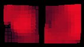
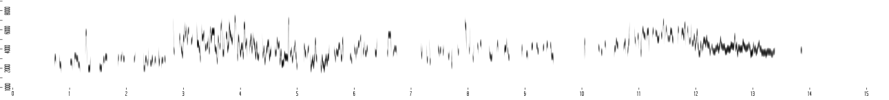
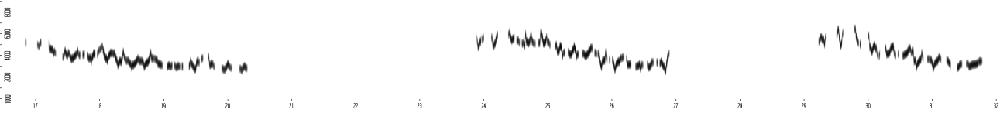
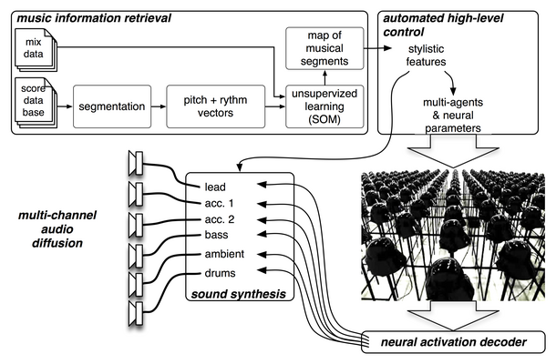

# Visual History: neuromuse Gallery

A selection of images spanning 25 years of development, artistic applications, and research.

## Early Experiments (~2000–2004)

<table>
  <tr>
    <td align="center" width="33%">
       
      MLP topology (2002): Nodes are neurons, links are synapses, color represents weight magnitude.
    </td>
    <td align="center" width="33%">
       
      Avatit agent (2004): Two SOMs (content and context) visualized in Pure Data.
    </td>
    <td align="center" width="33%">
       
      ROSOM (recurrent oscillatory SOM) learning a song pattern, Pure Data interface (2004).
    </td>
  </tr>
</table>

## Taire / L'Écarlate (2000–2001)

<table>
  <tr>
    <td align="center" width="25%">
       
      Architecture comparison: traditional vs. neuromimetic (Taire paper, 2001).
    </td>
    <td align="center" width="25%">
       
      L'Écarlate: Dance-derived input mapped to synthesis parameters via recurrent MLP.
    </td>
    <td align="center" width="25%">
       
      Performance by Toeplitz & Myriam Gourfink, IRCAM, June 2001.
    </td>
    <td align="center" width="25%">
       
      LOL (Laban Orienté Lisp): Movement capture interface by body part.
    </td>
  </tr>
</table>

## CIRM Nice Residency (2004)

<table>
  <tr>
    <td align="center" width="33%">
       
      Work session, CIRM Nice, July 2004.
    </td>
    <td align="center" width="33%">
       
      Invited talk: "Hybrid — Living in Paradox," Ars Electronica, September 2005.
    </td>
    <td align="center" width="33%">
       
      Demo/workshop, National Taiwan University, Taipei, 2003.
    </td>
  </tr>
</table>

## Symphonie des machines (2006)

<table>
  <tr>
    <td align="center" width="25%">
       
      Sun servers of the Infineon compute cluster (Sophia-Antipolis, 2006).
    </td>
    <td align="center" width="25%">
       
      Network topology visualization (EtherApe).
    </td>
    <td align="center" width="25%">
       
      Pure Data GUI controlling 25 Lisp agents on a grid, Eurecom.
    </td>
    <td align="center" width="25%">
       
      SOM computed in Lisp, bridged to Pd and Max via UDP.
    </td>
  </tr>
</table>

## Effet Lisière (Diois, 2008)

<table>
  <tr>
    <td align="center" width="50%">
       
      ROSOM before learning the willow warbler (pouillot fitis) song.
    </td>
    <td align="center" width="50%">
       
      Same ROSOM after hundreds of epochs of learning.
    </td>
  </tr>
</table>

## Last Manoeuvres in the Dark (2008)

<table>
  <tr>
    <td align="center" width="50%">
       
      Neural activation decoder: rows of Darth Vader helmet sculptures, Palais de Tokyo, Paris, 2008.
    </td>
    <td align="center" width="50%">
       
      System diagram: MIR, SOM-based analysis, multi-agent neural control, decoder.
    </td>
  </tr>
</table>

<table>
  <tr>
    <td align="center" width="50%">
       
      Distributed ARM cluster (Calao boards) running neuromuse agents in Java.
    </td>
    <td align="center" width="50%">
       
      Avatit agent controlling a robot arm at IRCAM (photo 2025).
    </td>
  </tr>
</table>

## neuromuse-ios

<table>
  <tr>
    <td align="center" width="50%">
       
      An iPhone 5s running <code>perceptron.l</code> on a Lisp interpreter built on Gregory Chaitin's
      lisp.c, training a perceptron on XOR — see
      <a href="https://github.com/FredVoisin/neuromuse-ios">neuromuse-ios</a>.
    </td>
  </tr>
</table>

---

**For more images and details, visit the full gallery at [fredvoisin.com/gallery.html](https://fredvoisin.com/gallery.html).**
