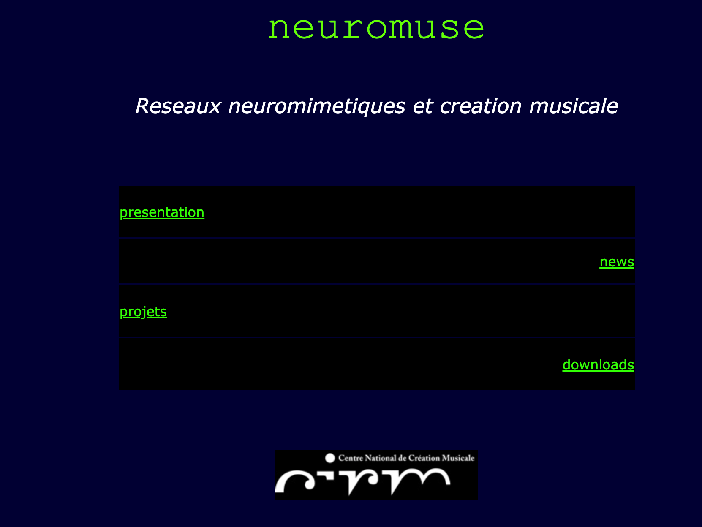

# Philosophy: Why Neuromuse Exists

## Présentation (Nice, mai 2005)

### neuromuse — Études et applications musicales des réseaux neuromimétiques

Compositeurs, musiciens, chorégraphes et danseurs recourent de plus en plus à l'informatique dans leurs projets, depuis le travail de création, pour l'exploration des possibles jusque la réalisation, selon différentes modalités de communication homme-machine. L'informatique — la machine universelle — est un outil privilégié de formalisation, d'expérimentation, de simulation et de réalisation.

Cependant, lors de mes différentes expériences comme ethnomusicologue et assistant musical, j'ai pu constater que lorsque la communication avec les machines s'effectue au moyen d'un code écrit dans un langage purement logique, la formalisation nécessaire à l'écriture de ce code peut s'avérer contradictoire avec la nature des connaissances invoquées, lesquelles peuvent être intuitives, inconscientes, implicites, contradictoires, irrationnelles ou magiques. L'informatique traditionnelle est encore peu adaptée à ces situations pourtant courantes, et naturelles, où opèrent des connaissances transitoires et des croyances. L'établissement d'une communication pertinente requiert une adaptation et une plasticité instantanées du programme, si ce n'est un mimétisme que suscite inévitablement le test de Turing. 

Dans ce contexte, les systèmes de réseaux de neurones artificiels, en s'inspirant de processus neurobiologiques, apparaissent comme une alternative particulièrement intéressante dès lors qu'ils situent l'auto-adaptation au cœur même du dispositif informatique.

C'est dans le cadre d'une recherche chorégraphique, en 2000, que j'ai été amené à écrire en langage Lisp mon premier réseau de neurones artificiels. Je constatai alors que si les systèmes neuromimétiques étaient bien capables d'apporter des réponses pertinentes dans les domaines artistiques, la compréhension et la maîtrise de leur fonctionnement constituait un vaste projet.

**Frédéric Voisin, Nice, mai 2005**

   
  Le site neuromuse.net tel qu'il se présentait en 2005, hébergé au CIRM (Nice).

---

## Presentation (English translation)

### neuromuse — Musical Studies and Applications of Neuromimic Networks

Composers, musicians, choreographers, and dancers increasingly resort to computing in their projects—from the work of creation, to exploring possibilities, to realization, according to different modes of human-machine communication. Computing—the universal machine—is a privileged tool for formalization, experimentation, simulation, and realization.

However, through my different experiences as an ethnomusicologist and musical assistant, I observed that when communication with machines takes place by means of code written in a purely logical language, the formalization necessary to write that code can prove contradictory to the nature of the knowledge invoked—knowledge that may be intuitive, unconscious, implicit, contradictory, irrational, or magical. Traditional computing remains poorly adapted to these situations—nonetheless common and natural—where transitory knowledge and beliefs operate. Establishing relevant communication requires instantaneous adaptation and plasticity of the program, if not a mimicry inevitably evoked by the Turing test.

In this context, systems of artificial neural networks, drawing inspiration from neurobiological processes, appear as a particularly interesting alternative insofar as they place self-adaptation at the very heart of the computing device.

It was within the framework of choreographic research, in 2000, that I came to write my first artificial neural network in Lisp. I then realized that while neuromimic systems were indeed capable of providing relevant answers in artistic domains, understanding and mastering their functioning constituted a vast project.

**Frédéric Voisin, Nice, May 2005**

---

## Core Principles

### 1. **Art is the Process, Not Just the Product**

Traditional AI frameworks treat networks as tools: you feed in data, extract predictions, move on. Neuromuse inverts this. The act of learning—neurons firing, weights adjusting, error curves falling—*is* the artwork. This matters because:

- **Transparency:** An artist can watch the network learn in real time, see what it "thinks," and respond.
- **Dialogue:** The artist doesn't just *make* the system; the system *makes* with the artist.
- **Embodiment:** Since neuromuse runs on modest hardware (even an iPhone 5s), the network can inhabit a physical space—a robot arm, a speaker array—and truly *exist* there.

### 2. **Knowledge Can Be Implicit, Intuitive, Contradictory**

Logic-based systems demand perfect formalization: every rule, every input, perfectly labeled. Real artistic and scientific knowledge isn't like that. A choreographer's movement vocabulary is embodied, never fully articulated. A musician's intuition about harmony is partly conscious, partly felt.

Neuromuse accepts this messiness. Networks learn from *examples* (implicit knowledge) rather than rules. They adapt to ambiguity, contradiction, and incompleteness—the very conditions under which artists and researchers actually work.

### 3. **Self-Adaptation is the Heart of It**

Rather than asking "How do I program the behavior I want?", neuromuse asks "How do I set up the conditions for adaptive behavior to emerge?" This shift is profound:

- **Learning happens live,** in dialogue with the user.
- **The system remains interpretable**—you can always ask why it made a choice.
- **Scale is measured in neurons, not parameters.** Neuromuse networks run on dozens or hundreds of neurons, not billions.

### 4. **Code Is Art, Too**

Neuromuse code is written to be *read*—by artists, by researchers, by students. A method in `src/mlp.lisp` is a mini-essay on how backpropagation works. The Lisp language itself, with its homoiconic structure (code-as-data), mirrors the self-reflective nature of learning systems.

---

## Historical Context

Neuromuse emerged in 1999–2001, when:

- GPUs didn't exist (CUDA launched in 2006).
- Neural networks were scientifically interesting but seemed impractical for real-time creative work.
- Lisp was still a serious environment for AI research (IRCAM, CNMAT, Symbolic Technologies).
- The question "Can a network learn choreography?" was genuinely novel.

Today, the landscape has shifted. Deep learning dominates. But neuromuse *still* serves a purpose that modern frameworks don't: it's a space where artists and researchers can **think with neural systems**, not just use them.

---

## For Artists

If you're a choreographer, musician, visual artist, or sound designer:

- Neuromuse lets you build systems that *learn from your practice*—your gestures, your improvisations, your scores.
- You can train a network to interpolate between two of your movement vocabularies, or generate variations on a theme.
- The system remains yours to understand and modify. No black box. No proprietary cloud.

## For Researchers

If you're studying:

- **Music information retrieval**, **gesture recognition**, **creative AI**, or **embodied cognition**: Neuromuse is a lab for small-scale, interpretable experiments.
- The codebase is compact enough to understand end-to-end, but complete enough for real work.
- You can extend it, combine it with ethnomusicological fieldwork, or use it as a teaching tool.

---

## Reference

- Voisin, F., Meier, R. (2004). "Playing Integrated Music Knowledges with Artificial Neural Networks." *Journées d'Informatique Musicale*, Ircam/Centre Pompidou, Paris.
- Voisin, F., Meier, R. (2009). "On Analytical vs. Schizophrenic Procedures for Computing Music." *Contemporary Music Review*, 28(2), pp. 205–219. [DOI](https://doi.org/10.1080/07494460903322489)
