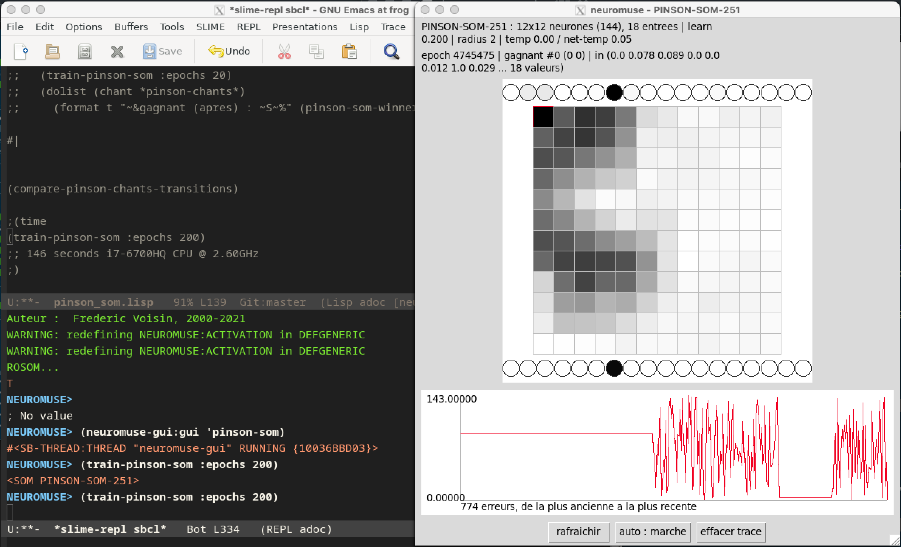

# SOM Examples: Self-Organizing Maps with neuromuse

Self-organizing maps learn to cluster high-dimensional data without labels: useful for exploratory
analysis and feature discovery. See [EXAMPLES.md](EXAMPLES.md) for the general, architecture-agnostic
workflow and Tips & Tricks, and [MLP-exemples.md](MLP-exemples.md) for MLP/rMLP.

*This file is a first draft, based on `examples/pinson_som.lisp` — pending Fred's review.*

## 1. Building a SOM

Unlike `mlp` (`make-mlp`) or `rmlp` (`make-rmlp`), there is no `make-som` constructor macro: build a
`som` directly with `make-instance`.

```lisp
(make-instance 'som :name 'my-som :size 144 :input 18)
```

- **`:size`** — total neuron count. The grid is always square (`2d`/`d2`, used to find a neuron's
  `(column row)` position and its neighbourhood, assume `side = sqrt size`), so pick a perfect square —
  144 here is a 12×12 grid.
- **`:input`** — dimensionality of each input vector (18 in the example below, one per FFT band).

`initialize-instance` binds the new instance to the `:name` symbol automatically, the same convention
as `make-mlp`/`make-rmlp`: afterward you can refer to it as `my-som` directly, not just via
`(symbol-value 'my-som)`.

### Key parameters

```lisp
(setf (learn-fact my-som) .3    ;; learning rate, same role as for an mlp
      (radius my-som) 2         ;; neighbourhood radius updated around the winner at each LEARN
      (temp my-som) 0.0         ;; output noise, see TEMP-VALUE in src/maths.lisp
      (net-temp my-som) 0.05)   ;; synaptic jitter during learning
```

Like `mlp`, `learn-fact` defaults to `0.0` — a freshly-built SOM won't learn anything until you set it.

## 2. Training

One learning step is `(learn som)`: present an input via `(setf (input som) ...)` (a vector, not a
list), then call `learn`. Like `backpropagate` for an `mlp`, it returns the SOM itself, so it can be
dropped straight into another function:

```lisp
(dotimes (epoch 100)
  (dolist (input training-vectors)
    (setf (input my-som) (coerce input 'vector))
    (learn my-som)))
```

A fixed presentation order favours degenerate solutions, the same pitfall as the XOR local minimum in
[MLP-exemples.md](MLP-exemples.md) — shuffle each epoch instead. `examples/pinson_som.lisp` wraps this
in `train-pinson-som`:

```lisp
(defun train-pinson-som (&key (epochs 20) (net 'pinson-som)
                               (vectors (all-pinson-vectors)) (verbose nil))
  "Presente chaque vecteur de VECTORS, EPOCHS fois, dans un ordre tire au
hasard a chaque epoque."
  (let* ((som (if (symbolp net) (symbol-value net) net))
         (n (length vectors)))
    (dotimes (e epochs (values som))
      (dolist (i (shuffled-indices n))
        (setf (input som) (coerce (nth i vectors) 'vector))
        (learn som))
      (when verbose (format t "~&epoch ~D/~D~%" (1+ e) epochs)))))
```

## 3. Finding the winner

`find-winner` returns `(neuron-instance distance)` for the neuron whose synaptic weights are closest to
the current `(input som)`. Its grid position comes from `2d`, which needs the neuron's flat index
(`(car (id neuron))`, assigned 0..N-1 at construction time) and the total neuron count:

```lisp
(defun pinson-som-winner (vector &optional (net 'pinson-som))
  "Coordonnees (colonne ligne) sur la grille du neurone gagnant de NET pour VECTOR."
  (let ((som (if (symbolp net) (symbol-value net) net)))
    (setf (input som) (coerce vector 'vector))
    (2d (car (id (car (find-winner som)))) (length (net som)))))
```

## 4. A worked example: chaffinch (pinson) birdsong

`examples/pinson_som.lisp` trains a 12×12 SOM (144 neurons) on 18-band FFT intensity vectors from 3
chaffinch (*Fringilla coelebs*) song recordings (`examples/pinson_vecteurs.lisp`, ~4000 frames total
across the 3 songs).

**Source audio:** the species and its song — see
[fr.wikipedia.org/wiki/Pinson_des_arbres](https://fr.wikipedia.org/wiki/Pinson_des_arbres) — for
example [Fringilla_coelebs.ogg](https://upload.wikimedia.org/wikipedia/commons/f/f9/Fringilla_coelebs.ogg)
(Wikimedia Commons, public domain): a chaffinch recorded singing in a spruce tree in southern Finland by
Oona Räisänen.

```lisp
(load "examples/pinson_vecteurs.lisp")   ; *pinson-freqs*, *pinson-chants*
(load "examples/pinson_som.lisp")        ; builds pinson-som
(train-pinson-som :epochs 100)
(pinson-som-winner (first (first *pinson-chants*)))
```

### Comparing trajectories between songs

Each song is a sequence of winning grid cells over time (one per frame). Comparing these frame-by-frame
doesn't work (the 3 songs have different lengths and tempos: 1249, 1433 and 1373 frames), and comparing
them as unordered sets of visited cells (`inventaire`/`inventaire-h` in `src/maths.lisp`) discards the
order entirely. `examples/pinson_som.lisp` instead builds a *transition matrix* per song (how often the
winner moves from cell A to cell B from one frame to the next) and compares those with cosine
similarity, which is insensitive to a song's length:

```lisp
(compare-pinson-chants-transitions)
;; => (((0 1) 0.9249053) ((0 2) 0.9022291) ((1 2) 0.96922594))
```

Reading the pairs `(i j)` as song indices: songs 2 and 3 (`(1 2)`) share the most transition structure
here, songs 1 and 3 (`(0 2)`) the least. Caveats: this reflects whatever training state `pinson-som`
happens to be in when called (it doesn't retrain), and there's no baseline yet for what counts as
"close" versus "different" in absolute terms — a useful next step would be comparing a single song's
two halves against each other, to calibrate the scale. A DTW (Dynamic Time Warping) alignment of the
raw winner sequences is the natural follow-up if this comparison turns out not to discriminate the
songs well enough. Other methods to compare trajectories, when seen as musical profiles, can be also be
adapted from the [Morphologie](https://github.com/FredVoisin/Morphologie) project.

## 5. Watching it train live: the SOM viewer

As well as the other archtectures, one can pragmatically overcome the difficulty of systematically 
computing trajectory differences through dual observation: listening to the audio synthesis of output 
activations and visually inspecting the self-organizing map's cell activations.
So, `neuromuse-gui` also has a SOM-specific window (`src/gui.lisp`), separate from the MLP heatmap/graph
view since a SOM's `net` is a flat list of neurons, not layered weight matrices. It shows the map as a
grid shaded by each neuron's activity (darker = closer to the current input, the winner outlined in
red), the current input as a row of circles above, the winning neuron's output as a row below, and a
trace of the winner's index over time at the bottom.

```lisp
(ql:quickload :ltk)                  ; once per session; needs Tk installed (Debian: apt install tk)
(asdf:load-system "neuromuse/gui")   ; note the string, not a keyword

(neuromuse-gui:gui 'pinson-som)      ; dispatches to the SOM viewer automatically
```

<p align="center">
  <br>
  <sub>The SOM viewer on <code>pinson-som</code>: 12×12 activity map (winner outlined in red), input row
  on top, winner's output row and winner-index trace below.</sub>
</p>

And as with the others, observation often suggests adapting learning parameters such as learning rate `(learn-fact)`,
synaptic temperature `(net-temp)`, and radius `(radius)`. The Lisp code also permits—and this is worth 
emphasizing—reshaping the self-organizing map on the fly during training, for example by adding cells, provided 
one carefully considers the SOM's geometry and topology.

## Further Reading

- See `src/som.lisp` for the full SOM implementation and docstrings.
- See `src/rosom.lisp` for the recurrent oscillatory SOM (`rosom`) — pairs a content SOM with a context
  SOM; not covered here yet.
- See [EXAMPLES.md](EXAMPLES.md) for the general, architecture-agnostic workflow and Tips & Tricks.
- See [MLP-exemples.md](MLP-exemples.md) for MLP/rMLP.
